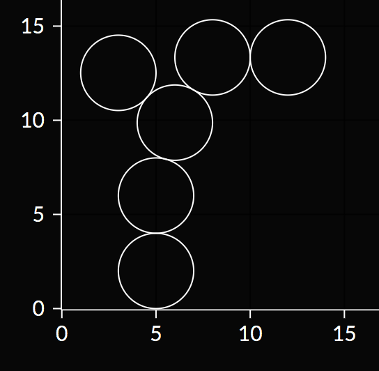

# Керлинг :curling_stone:

Кэрол играет в керлинг.
У нее есть n дисков радиуса r1,r2,...,rn на плоскости.
Изначально все диски находятся выше линии y=10100.
Кэрол пускает диски по направлению к прямой y=0 по одному в порядке от 1 до n.

Когда она пускает i-й диск, она ставит его центр в точку (xi,10100),
а затем толкает его так, что его y координата начинает уменьшаться,
а координата x остается постоянной.
Диск останавливается, когда он касается прямой y=0 или любого предыдущего диска.
Обратите внимание, как только диск остановился, он больше не двигается, даже от удара следующих дисков.
Вычислите координату y центров всех дисков после того, как они остановятся.

### Входные данные

Первая строка содержит два целых числа n (1 ≤ n ≤ 1000) — количество дисков.

Следующая строка содержит n целых чисел x1,x2,...,xn
(1 ≤ xi,ri ≤ 1000) — x-координаты дисков и радиус каждого диска,
соответственно.

### Выходные данные

Выведите единственную строку с n числами.
i-е из этих чисел должно быть равно итоговой y-координате центра i-го диска.

### Пример

| входные данные                                     | выходные данные                                      |
|----------------------------------------------------|------------------------------------------------------|
| 6 5 2 5 2 6 2 8 2 3 2 12 2 | 2 6.0 9.872 13.337 12.518 13.337 |

<kbd>

</kbd>
