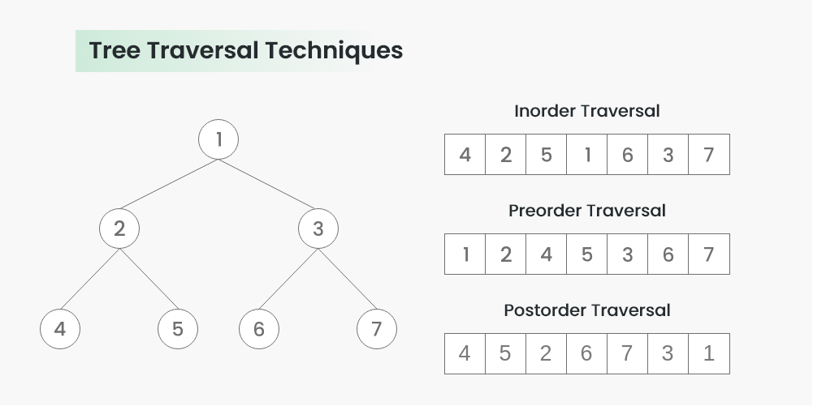

# Дерево отрезков
Дерево отрезков — это структура данных, которая позволяет эффективно (т.е. за **O(log n)**) реализовать операции следующего вида: нахождение суммы/минимума элементов массива в заданном отрезке (**a[l...r]**, где **l** и **r** поступают на вход алгоритма), при этом дополнительно возможно изменение элементов массива.

## Задача 1

Дополнить данный код так, чтобы для входного массива
было создано показанное на картинке дерево отрезков,
где каждый узел дерва хранит сумму элементов своего отрезка.

```c++
#include <vector>

class SegmentTree {
    struct Node {
        Node *left{};
        Node *right{};
        Node *parent{};
        size_t range_left{};
        size_t range_right{};
        int range_sum{};

        Node(const std::vector<int> &array, size_t range_left, size_t range_right, Node *parent)
            : range_left(range_left),
              range_right(range_right),
              parent(parent) {
            // Add your code here
        }
    };

    Node *root;
    size_t array_size;

public:
    explicit SegmentTree(const std::vector<int> &array) : array_size(array.size()) {
        root = new Node(array, 0, array_size - 1, nullptr);
    }
};

int main() {
    const std::vector v = {
        13, -1, 2, 23, -4, 231, 13, 5,
        2, -88, -52, 0, 4, 90, 3, -12
    };
    SegmentTree st(v);
}
```

<table><tr><td>

</td></tr></table>

## Задача 2
Добавить в класс **SegmentTree** следующие рекурсивные функции для обхода дерева,
которые напечатают значения узлов дерева во время обхода.
```c++
void inorder_traversal();
void preorder_traversal();
void post_traversal();
```

<table><tr><td>

</td></tr></table>

## Задача 3
Добавить в класс **SegmentTree** функцию **update**, которая поменяет значение **k**-го элемента массива на **x**,
(т.е. **a[k] = x;**) и поменяет значения узлов дерева отрезков, которые зависили от **k**-го элемента массива.
```c++
void update(size_t k, int x);
```

## Задача 4
Добавить в класс **SegmentTree** функцию **getSum**, которая возвращает сумму элементов интервала **[left, right]**.
```c++
int getMin(size_t left, size_t right);
```
