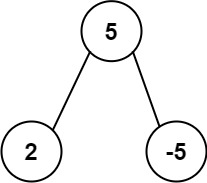

# Домашнее Задание 3
Правила отправки домашнего задания описаны [тут](./info.md).

## Задачи с исползованием Set (1 балл)
Все следующие задачи должны быть решены с исползованием **std::set** из стандартной библиотеки.
Тут можно посмотреть описание структуры [std::set](https://en.cppreference.com/w/cpp/container/set).

### Задача 1
Вам дан список из n целых чисел, ваша задача — посчитать количество различных значений в списке.
#### Входные данные:
```
5
2 3 2 2 3
```
#### Выходные данные:
```
2
```

### Задача 2
Вам даны строка **jewels**, представляющие типы камней, которые являются драгоценными камнями, и **stones**, представляющие те камни, которые у вас есть.
Каждый символ в **stones** — это камень, который у вас есть. Вы хотите знать, сколько камней у вас также являются драгоценностями.
Буквы чувствительны к регистру, поэтому "а" считается другим типом камня, чем "А".
```
Input: jewels = "aA", stones = "aAAbbbb"
Output: 3

Input: jewels = "z", stones = "ZZ"
Output: 0
```

### Задача 3
Дана строка **s**, найдите длину самой длинной подстроки без повторяющихся символов.
Решить задачу за **O(N*log(N))**.

#### Примеры
```
Input: s = "abcabcbb"
Output: 3
Explanation: The answer is "abc", with the length of 3.

Input: s = "bbbbb"
Output: 1
Explanation: The answer is "b", with the length of 1.

Input: s = "pwwkew"
Output: 3
Explanation: The answer is "wke", with the length of 3.
Notice that the answer must be a substring, "pwke" is a subsequence and not a substring.
```

## Задачи с исползованием Map (2 балл)
Все следующие задачи должны быть решены с исползованием **std::map** из стандартной библиотеки.
Тут можно посмотреть описание структуры [std::map](https://en.cppreference.com/w/cpp/container/map).

### Задача 1
Дана строка s, найдите в ней первый неповторяющийся символ и верните его индекс. Если он не существует, верните -1.
Решить задачу за **O(N*log(N))**.

#### Примеры
```
Input: s = "apple"
Output: 0

Input: s = "staticanalysis"
Output: 5

Input: s = "aabb"
Output: -1
```

### Задача 2
Имея строку **s**, состоящая из строчных или прописных букв, верните длину самого длинного палиндрома, который можно построить из этих букв.
Буквы чувствительны к регистру, например, "Аа" здесь не считается палиндромом.
Решить задачу за **O(N*log(N))**.

#### Пример
```
Input: s = "acbcccdd"
Output: 7
Explanation: One longest palindrome that can be built is "dccaccd", whose length is 7.
```

### Задача 3
Задан целочисленный массив **nums** и целое число **k**, напечатать "true",
если в массиве есть два различных индекса **i** и **j**, такие что **nums[i] == nums[j]** и **abs(i - j) <= k**.
Напечатать "false" в противном случае.
Решить задачу за **O(N*log(N))**.

#### Примеры
```
Input: nums = [1,2,3,1], k = 3
Output: true

Input: nums = [1,0,1,1], k = 1
Output: true

Input: nums = [1,2,3,1,2,3], k = 2
Output: false
```

### Задача 4
Задан шаблон и строка **s**. Найдите, соответствует ли **s** тому же шаблону.
Здесь **соответствует** означает полное совпадение, такое,
что существует биекция между буквой в образце и непустым словом в **s**.
Решить задачу за **O(N*log(N))**.

#### Примеры
```
Input: pattern = "abba", s = "dog cat cat dog"
Output: true

Input: pattern = "abba", s = "dog cat cat fish"
Output: false

Input: pattern = "aaaa", s = "dog cat cat dog"
Output: false
```

### Задача 5
Дана строка **s**, отсортируйте ее в порядке убывания частоты встречаемости символов. Частота символа — это количество раз, которое он появляется в строке.
Вернуть отсортированную строку. Если ответов несколько, верните любой из них.

#### Примеры
```
Input: s = "tree"
Output: "eert"
Explanation: 'e' appears twice while 'r' and 't' both appear once.
So 'e' must appear before both 'r' and 't'. Therefore "eetr" is also a valid answer.

Input: s = "cccaaa"
Output: "aaaccc"
Explanation: Both 'c' and 'a' appear three times, so both "cccaaa" and "aaaccc" are valid answers.
Note that "cacaca" is incorrect, as the same characters must be together.

Input: s = "Aabb"
Output: "bbAa"
Explanation: "bbaA" is also a valid answer, but "Aabb" is incorrect.
Note that 'A' and 'a' are treated as two different characters.
```

## Задача 6
Вам предоставляется структура данных **Trie** (реализованая используя **std::map**), которая поддерживает вставку слов.
Ваша задача — написать функцию **startWith**, которая принимает на вход префикс и проверяет,
существует ли в **Trie** хотя бы одно слово, начинающееся с данного префикса.
Функция должна возвращать **true**, если такое слово существует, в противном случае она должна вернуть **false**.

**Например:**
Предположим, что **Trie** содержит слова: "Hello", "Hey", "World".
Если вы вызываете `startWith("He")`, функция должна вернуть **true**, поскольку оба слова "Hello" и "Hey" начинаются с префикса "He".

```c++
#include <iostream>
#include <map>

class Trie {
  class TrieNode {
  public:
    std::map<char, TrieNode *> children;
    bool isEndOfWord;

    TrieNode() {
      isEndOfWord = false;
    }
  };

  TrieNode *root;

public:
  Trie() {
    root = new TrieNode();
  }

  ~Trie() {
    // Also add the destructor...
  }

  void insert(const std::string &word) {
    TrieNode *current = root;
    for (char ch: word) {
      if (current->children.find(ch) == current->children.end()) {
        current->children[ch] = new TrieNode();
      }
      current = current->children[ch];
    }
    current->isEndOfWord = true;
  }

  bool startsWith(const std::string &prefix) {
    // Add you code here
  }
};

int main() {
  Trie trie;
  trie.insert("Hello");
  trie.insert("Hey");
  trie.insert("World");

  std::cout << trie.startsWith("Hell") << std::endl; // Output: true
  std::cout << trie.startsWith("abc") << std::endl;  // Output: false
  std::cout << trie.startsWith("Wo") << std::endl;  // Output: true
}
```

## Задача 7
Дан корень двоичного дерева, верните наиболее часто встречающуюся сумму поддерева.
Если таких сумм несколько, верните все значения с наибольшей частотой в любом порядке.

Сумма поддерева узла определяется как сумма всех значений узлов, образованных поддеревом, корнем которого является этот узел (включая сам узел).
Алгоритм должен работать как можно оптимально.
```c++
struct TreeNode {
    int val;
    TreeNode *left;
    TreeNode *right;
    TreeNode() : val(0), left(nullptr), right(nullptr) {}
    TreeNode(int x) : val(x), left(nullptr), right(nullptr) {}
    TreeNode(int x, TreeNode *left, TreeNode *right) : val(x), left(left), right(right) {}
};

std::vector<int> findFrequentTreeSum(TreeNode* root);
```

#### Примеры
<table><tr><td>

</td></tr></table>

**Output: [2,-3,4]**

<table><tr><td>

</td></tr></table>

**Output: [2]**
